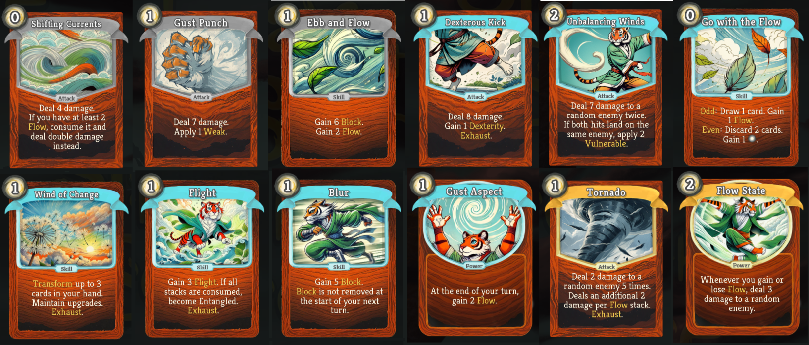
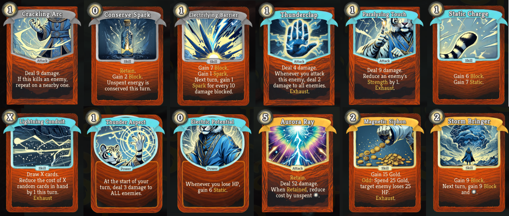
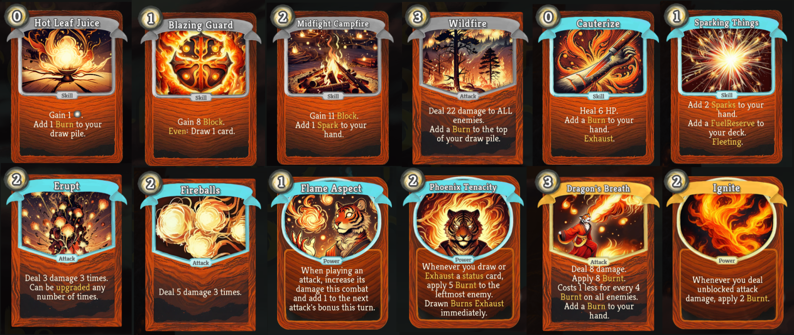

Mandarina is a custom Slay the Spire character built around dynamic elemental synergies, positional mechanics, and multi-use cards. It's a character that rewards strategic sequencing and embraces fun-centric deck-building. Mandarina is a master of the volatile elements (or aspects) which are Gust, Thunder, Flame, and Shadow. These elements have been learnt at different stages of its erratic lifespan. Mandarina does not use weapons but rather different fighting techniques. And its claws, it is a Tiger, after all

## Mechanics:

Order/Positional Play:

Some of Mandarina’s cards reward the order (or timing) in which cards are played. For instance:

Odd: Triggers when the card is played 1st, 3rd, 5th… in a turn.

Even: Triggers effect when the card is played 2nd, 4th in a turn.

Third: You guessed it, triggers when played 3rd.

### Elemental aspects:

Gust 🌀

Generates and consumes Flow to draw cards and fuel combos. Focuses on random attacks and energy-efficient turns too. Agile, random.

Thunder ⚡

Reactive mechanics that deal damage when attacked, many small AOE damage instances. Reactive, AOE, and well, Aurora Ray.

Flame 🔥

Multi-hit attacks, base attack damage increase on use, Burnt debuff. Ramping, multi-hit, multi-attack turns, burnt generation.

Shadow 🌑

Subtle control with the debuff-heavy and double-edged Cursed Block playstyles, some other odd cards. Block, high-risk high-reward, debuff-heavy

All aspects have some block, draw and energy generation.

### Elemental mechanics:

Flow : If you have at least 3 Flow stacks, draw 1 extra card at the start of your turn and lose 1 stack of Flow.
Which can be spent or accumulated for combo effects.

Static: When attacked, deal damage back. If you have Thunder Aspect, hit ALL enemies.

Burnt : Burnt creatures lose HP at the end of their turn. Each turn, Burnt is reduced by half.

Cursed Block : Protects creatures from damage. If broken, they gain Poison equal to half the block lost.

### Other:

Some cards have branching upgrades, giving you even more options to set up a perfect deck.
### Some card examples

Gust cards:

Thunder cards:

Flame cards:

240
122x244