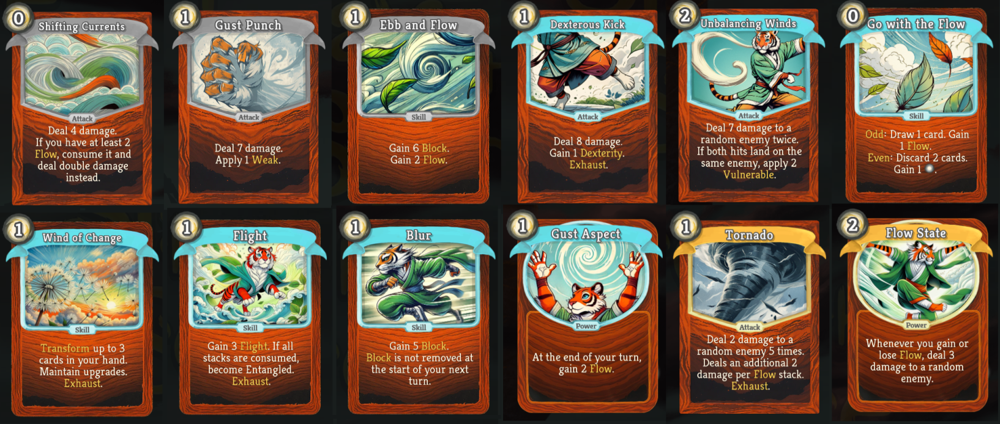

# The Volatile - Slay the Spire Mod

| **[Steam Workshop] COMING SOON (https://steamcommunity.com/sharedfiles/filedetails/** | **[Download JAR](https://github.com/h/Ed/releases)** |
|---------------------------------------------------------------------------------------|-------------------------------------------------------------------------------------|
---
## Description

A mod that adds a custom character for the hit deck building game [Slay the Spire](https://store.steampowered.com/app/646570/Slay_the_Spire/).

Mandarina, also known as The Volatile is a custom Slay the Spire character built around dynamic elemental synergies, positional mechanics, and multi-use cards. It's a character that rewards strategic sequencing and embraces fun-centric deck-building. Mandarina is a master of the volatile elements (or aspects) which are Gust, Thunder, Flame, and Shadow. These elements have been learnt at different stages of its erratic lifespan. Mandarina does not use weapons but rather different fighting techniques. And its claws, it is a Tiger, after all.

## Mod Dependencies:
* ModTheSpire ([Steam Workshop](https://steamcommunity.com/sharedfiles/filedetails/?id=1605060445) - [Github](https://github.com/kiooeht/ModTheSpire))
* BaseMod ([Steam Workshop](https://steamcommunity.com/sharedfiles/filedetails/?id=1605833019) - [Github](https://github.com/daviscook477/BaseMod/releases))
* StSLib ([Steam Workshop](https://steamcommunity.com/sharedfiles/filedetails/?id=1609158507) - [Github](https://github.com/kiooeht/StSLib/releases))
* Friendly Monsters ([Steam Workshop](https://steamcommunity.com/sharedfiles/filedetails/?id=2816293692) - [Github](https://github.com/hlysine/FriendlyMonsters/releases))

## Mechanics

Order/Positional Play:

Some of Mandarina’s cards reward the order (or timing) in which cards are played. For instance:

Odd: Triggers when the card is played 1st, 3rd, 5th… in a turn.

Even: Triggers effect when the card is played 2nd, 4th in a turn.

Third: You guessed it, triggers when played 3rd.

### Elemental aspects

Gust 🌀

Generates and consumes Flow to draw cards and fuel combos. Focuses on random attacks and energy-efficient turns too. Agile, random.

Thunder ⚡

Reactive mechanics that deal damage when attacked, many small AOE damage instances. Reactive, AOE, and well, Aurora Ray.

Flame 🔥

Multi-hit attacks, base attack damage increase on use, Burnt debuff. Ramping, multi-hit, multi-attack turns, burnt generation.

Shadow 🌑

Subtle control with the debuff-heavy and double-edged Cursed Block playstyles, some other odd cards. Block, high-risk high-reward, debuff-heavy

All aspects have some block, draw and energy generation.

### Elemental mechanics

Flow : If you have at least 3 Flow stacks, draw 1 extra card at the start of your turn and lose 1 stack of Flow.
Which can be spent or accumulated for combo effects.

Static: When attacked, deal damage back. If you have Thunder Aspect, hit ALL enemies.

Burnt : Burnt creatures lose HP at the end of their turn. Each turn, Burnt is reduced by half.

Cursed Block : Protects creatures from damage. If broken, they gain Poison equal to half the block lost.

### Other

Some cards have branching upgrades, giving you even more options to set up a perfect deck.
### Some card examples

Gust cards:

Thunder cards:

Flame cards:

## Backstory
    Mandarina was once a spirited player of games of luck and mischief,
    always seeking the next clever trick or cheeky tactic to outwit his friends and foes.
    
    But one fateful day, his life took an unforeseen turn—
    a game he couldn't win and a debt he couldn't escape.
    He's now trapped in the spire. 

    Ascending like a chaotic vortex. 
    Striking with thunderous precision.
    Sometimes burning in flames.
    Sometimes looming in the shadows.
    
    What drives him? Revenge? Redemption? Or the burning desire to prove that even the most elusive forces
    can be wielded not by a steady hand but by the most volatile of them all.
    
    Will his cunning be enough to outplay his past and reclaim his joy?
    Or will the final game consume him into an empty void?
    
    It's your move.